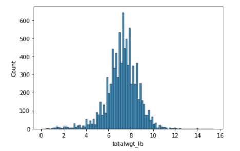
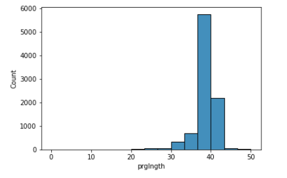

[Think Stats Chapter 2 Exercise 4](http://greenteapress.com/thinkstats2/html/thinkstats2003.html#toc24) (Cohen's d)

***Exercise 2.4*** Using the variable totalwgt_lb, investigate whether first babies are lighter or heavier than others. Compute Cohen’s d to quantify the difference between the groups. How does it compare to the difference in pregnancy length?

**Approach**

The author provided the dataset as well as a custom Python library with a function to read the dataset into a Python Pandas dataframe.

```python
import nsfg
preg = nsfg.ReadFemPreg()
```

The dataframe needed filtered to pregnancies that resulted in a live birth. The variable outcome indicates live birth with the value of 1.

```python
live_births = preg[preg['outcome'] == 1]
```

After filtering to only the live births, I checked for any outliers in totalwgt_lb by reviewing a histogram. 

```python
import seaborn as sns
sns.histplot(live_births['totalwgt_lb'])
sns.histplot(live_births['prglngth'])
```



I also graphed a histogram for the prglngth as pregnancy length is also of interest for this question. 



There are some low values of totalwgt_lb that correspond to the low values of prglngth.  

```python
live_births['totalwgt_lb'].value_counts().sort_index().head(10)
live_births['prglngth'].value_counts().sort_index().head(10)
```

***Table 1.*** *Number of live births of the ten lowest values of totalwgt_lb.*

| Totalwgt_lb | Count |
| ----------- | ----- |
| 0.1250      | 1     |
| 0.3125      | 1     |
| 0.4375      | 1     |
| 0.5625      | 1     |
| 0.6250      | 2     |
| 0.9375      | 1     |
| 1.0000      | 1     |
| 1.0625      | 3     |
| 1.1250      | 2     |
| 1.1875      | 1     |

***Table 2.*** *Number of pregnancies of the ten shortest lengths in weeks that resulted in live births.*

| Pregnancy Length in Weeks | Count |
| ------------------------- | ----- |
| 0                         | 1     |
| 4                         | 1     |
| 9                         | 1     |
| 13                        | 1     |
| 17                        | 2     |
| 18                        | 1     |
| 19                        | 1     |
| 20                        | 1     |
| 21                        | 2     |
| 22                        | 7     |

After further review and to be consistent with the author's handling, I chose to keep these values. I then separated the live births subset into a group containing all the data for first births and another group with all the data for the other births. 

```python
first_births = live_births[live_births['birthord'] == 1]
other_births = live_births[live_births['birthord'] != 1]
```

The author provided a function to calculate Cohen's d:

```python
def CohenEffectSize(group1, group2):
    """Computes Cohen's effect size for two groups.
    
    group1: Series or DataFrame
    group2: Series or DataFrame
    
    returns: float if the arguments are Series;
             Series if the arguments are DataFrames
    """
    diff = group1.mean() - group2.mean()

    var1 = group1.var()
    var2 = group2.var()
    n1, n2 = len(group1), len(group2)

    pooled_var = (n1 * var1 + n2 * var2) / (n1 + n2)
    d = diff / np.sqrt(pooled_var)
    return d
```

I passed the totalwgt_lb data for each of these two groups to this function.  

```python
CohenEffectSize(first_births['totalwgt_lb'], other_births['totalwgt_lb'])
```

To compare the difference in pregnancy length, I passed the prglngth data for each of these two groups to the Cohen's D function. 

```python
CohenEffectSize(first_births['prglngth'], other_births['prglngth'])
```


**Solution**

The Cohen's D of the difference in totalwgt_lb of first births and all other births is -0.08867. Thus, there is very small effect on totalwgt_lb being less with the first birth. 

The Cohen's D of the difference in pregnancy length of first births and all other births is 0.028879. Thus, there is a small effect on pregnancy length being longer with the first birth. 

