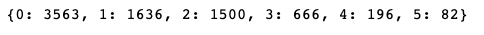
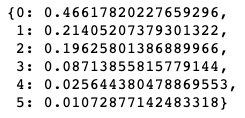
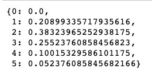
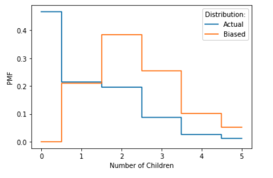

[Think Stats Chapter 3 Exercise 1](http://greenteapress.com/thinkstats2/html/thinkstats2004.html#toc31) (actual vs. biased)

**Exercise 3.1** Something like the class size paradox appears if you survey children and ask how many children are in their family. Families with many children are more likely to appear in your sample, and families with no children have no chance to be in the sample.

Use the NSFG respondent variable NUMKDHH to construct the actual distribution for the number of children under 18 in the household.

Now compute the biased distribution we would see if we surveyed the children and asked them how many children under 18 (including themselves) are in their household.

Plot the actual and biased distributions, and compute their means.


**Approach**

The author provided the NSFG respondent dataset as well as a custom Python library with a function to read the dataset into a Python Pandas dataframe.

```python
import nsfg
resp = nsfg.ReadFemResp()
```

I aggregated the counts of the respondent variable NUMKDHH by number of children under 18 in the household.  I put this information into a Python dictionary where the keys are the number of children under 18 in the household, and the values are the number of families in the survey that have this number of children. 

```python
counts_actual = dict(resp['numkdhh'].value_counts())
```

The counts_actual dictionary looks like this:



To create the PMF for the actual distribution, I divided each of the values in the counts_actual dictionary by the total number of families in the survey. 

```python
n=sum(counts_actual.values())
pmf_actual = {}
for x, freq in counts_actual.items():
    pmf_actual[x] = freq / n
```

The pmf_actual looks like this: 



To compute the biased distribution, I first multiplied each value for number of children in the family by its probability in the PMF for the actual distribution. Then I normalized these values by dividing by sum of the resulting probabilities.  

```python
new_pmf = pmf_actual.copy()
for x, p in pmf_actual.items():
    new_pmf[x] = x * p
    
m =sum(new_pmf.values())

pmf_biased = {}
for x, p in new_pmf.items():
    pmf_biased[x] = p / m   
```

The PMF of the biased distribution looks like this:



To plot the actual and biased distributions:

```python
import matplotlib.pyplot as plt

x_a = list(pmf_actual.keys())
y_a = list(pmf_actual.values())

x_b = list(pmf_biased.keys())
y_b = list(pmf_biased.values())

plt.step(x_a, y_a, label="Actual", where='mid')
plt.step(x_b, y_b, label='Biased', where='mid')

plt.xlabel("Number of Children")
plt.ylabel("PMF")

plt.legend(title='Distribution:')
plt.show()
```


To compute the means of each PMF:

```python
# mean of actual distribution
sum([x*p for x,p in pmf_actual.items()])

# mean of biased distribution
sum([x*p for x,p in pmf_biased.items()])
```


**Solution**

The plot of the actual and biased distributions is:



The mean of the actual distribution rounded to two decimal places is 1.02.

The mean of the biased distribution rounded to two decimal places is 2.40.


