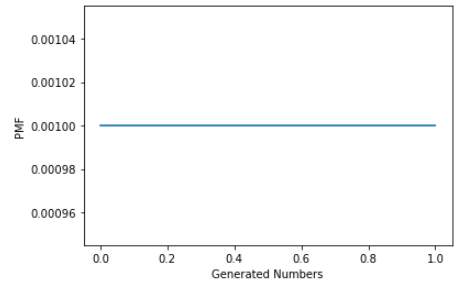
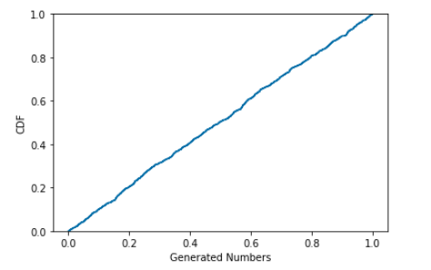

[Think Stats Chapter 4 Exercise 2](http://greenteapress.com/thinkstats2/html/thinkstats2005.html#toc41) (a random distribution)

***Exercise 4.2*** The numbers generated by random.random are supposed to be uniform between 0 and 1; that is, every value in the range should have the same probability.

Generate 1000 numbers from random.random and plot their PMF and CDF. Is the distribution uniform?


**Approach**

I imported the Python Numpy library to use the random.random method to generate 1000 numbers between 0 and 1. Then, I put the resulting array of 1000 numbers into a Pandas series so that I could create a dictionary of the frequency counts for each generated number.  With the frequency counts in a dictionary, I then created a dictionary with the PMF. 

```python
import numpy as np
import pandas as pd
import matplotlib.pyplot as plt
import seaborn as sns

random_1000 = np.random.random(1000)
series_1000 = pd.Series(random_1000)

freq_counts = dict(series_1000.value_counts().sort_index())
n=sum(freq_counts.values())
pmf = {}
for x, freq in freq_counts.items():
    pmf[x] = freq / n
```

To create the plots of PMF and CDF:

```python
# plot PMF
x = list(pmf.keys())
y = list(pmf.values())
plt.step(x, y, where='mid')
plt.xlabel("Generated Numbers")
plt.ylabel("PMF")
plt.show()

# plot CDF
cdf = sns.ecdfplot(random_1000)
plt.xlabel("Generated Numbers")
plt.ylabel("CDF")
plt.show(cdf)
```


**Solution**

Plot of PMF:



Plot of CDF:




The distribution of the 1000 numbers generated with Numpy random.random closely resembles a uniform distribution. 

